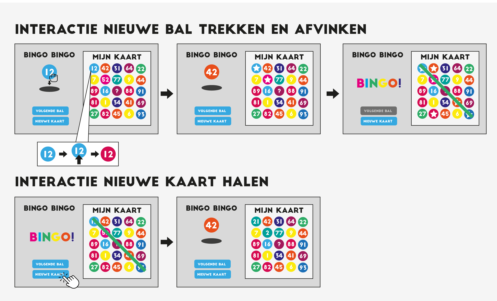

# Procesverslag
**Auteur:** Niels Antonis

**De opdrachten:** [opdracht 1](opdracht1/index.html) en [opdracht 2](opdracht2/index.html)

Markdown is een simpele manier om HTML te schrijven.  
Markdown cheat cheet: [Hulp bij het schrijven van Markdown](https://github.com/adam-p/markdown-here/wiki/Markdown-Cheatsheet).

Nb. De standaardstructuur en de spartaanse opmaak van de README.md zijn helemaal prima. Het gaat om de inhoud van je procesverslag. Besteedt de tijd voor pracht en praal aan je website.

Nb. Door *open* toe te voegen aan een *details* element kun je deze standaard open zetten. Fijn om dat steeds voor de relevante stuk(ken) te doen.

## Bronnenlijst
  1. https://www.youtube.com/watch?v=I9PJ2vrwpYM&ab_channel=CodingArtist Voorbeeld voor hoe vallende tekst gemaakt kan worden.
  2. https://lukelowrey.com/css-variable-theme-switcher/ Uitleg over Light en Dark-mode en hoe dit toegepast kan worden.
  3. https://css-tricks.com/snippets/css/a-guide-to-flexbox/ Duidelijke visuele uitleg over de mogelijkheden van Flex.

## Opdracht 1 plan

  
uitwerken na schetsen idee (voor week 2)

  

  ### Je storyboard:  
  
  
    
    

  ### Je ambitie:  
  
  
  Aan deze technieken/punten wil ik werken:  
  - Het maken van vormen met alleen CSS
  - Beter begrijpen wat ik allemaal met de before en after properties kan doen
  - Mooie vloeiende animaties maken
  - Het creeeren van een eindproduct dat goed past bij de look en feel van mijn gekozen brand
 

## Opdracht 1 reflectie

  
uitwerken bij afronden opdracht (voor week 3)

  
  
  ### Je uitkomst - karakteristiek screenshot(s):  
  

  
  
  
    
  

  ### Dit ging goed/Heb ik geleerd:  
  Ik vind de vormen die ik heb kunnen creeëren met mijn animatie goed gelukt en passen bij de Nintendo Switch, het heeft de vorm van een Switch en de animatie past bij hoe de console werkt en de branding van Nintendo. Ik heb geleerd om objecten beter uit te lijnen en heb me verder kunnen verdiepen in het werken met animaties en het toepassen van keyframes.  
  

    
  
  
    

  
  ### Dit was lastig/Is niet gelukt:  
  Ik had graag wat meer fancy dingetjes gedaan met mijn animatie, de letters zelf doen nu namelijk niet zoveel als de console die ik eromheen heb gebouwd. Verder zou ik ook beter willen zijn in het aanpassen van mijn css zodat het ook op mobiel goed werkt. In mijn inspector werkt het soms wel, soms niet zonder de code die ik er extra bij gemaakt heb en ik twijfel of het goed is.  

  

## Opdracht 2 plan

  
uitwerken na schetsen idee (voor week 4)

  ### Je ontwerp:  
  
  
    

  ### Je ambitie: 
  
  
  Aan deze technieken/punten wil ik werken:
  - Het maken van een werkende Bingokaart die zelf herkent of het balletje overeenkomt met 1 van de nummers op de kaart doormiddel van Javascript.
  - Beter begrijpen en oefenen met Custom Properties en een de root in css.
  - Toepassen van Light/Dark-mode zonder dat hier een knop voor hoeft ingedrukt te worden. De code moet zien wat de gebruiker als voorkeur heeft ingesteld.
  - Het toepassen van Drag&Drop in een webpagina.

## Opdracht 2 reflectie

  
uitwerken bij afronden opdracht (voor week 8)

  
  ### Je uitkomst - karakteristiek screenshot(s):   
  
  
    

  ### Dit ging goed/Heb ik geleerd:  
  
  
  Ik vind dat mijn Javascript goed gelukt is en ondanks dat de opmaak wat minimalistisch is ziet het er niet verkeerd uit. De bingokaart functioneert en kan zichzelf afstrepen zodra een balletje getrokken is. Ik heb custom properties verder proberen toe te passen dan op alleen kleur en veel voorkomende waarde verwerkt in de root. Daarnaast ben ik tevreden over de automatische Light en Dark mode die zichzelf instelt op basis van de gebruikers voorkeur.  

  
    

  ### Dit was lastig/Is niet gelukt:  
  
  
  Ik had graag iets dieper in de drag en drop willen duiken. Deze is nu minimaal uitgewerkt. Verder had ik meer aandacht aan de opmaak willen besteden en meer interactie animaties willen toepassen. Daarnaast had mijn Javascript iets compacter gekund, maar helaas kreeg ik dit niet goed voor elkaar door mijn mindere kennis over het gebruikt van loops.  

  
  

